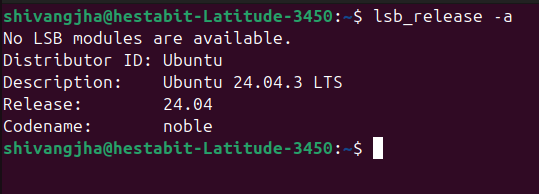
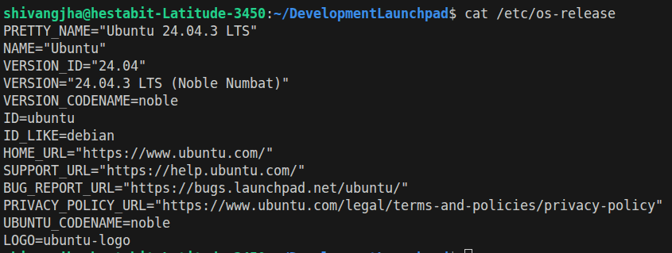
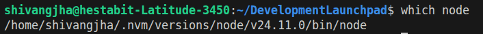
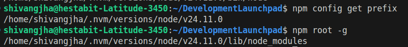
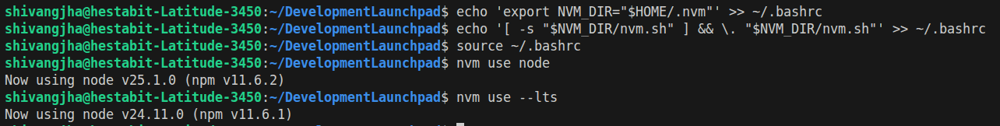
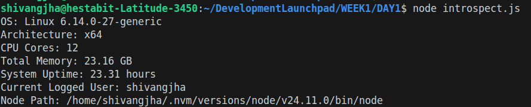
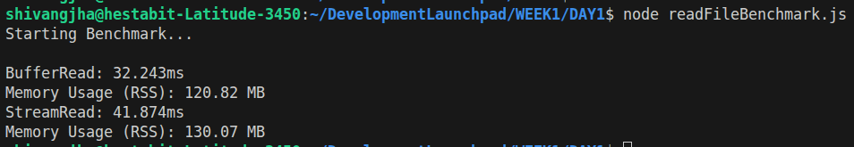

# Week 1 - Node and Terminal Mastering

1. OS Version

    a) Using the command `lsb_release -a`
    This command provides Linux Standard Base (LSB) details and distribution-specific information about the current Linux distribution.

    Output:     
        
    b) Using the command cat /etc/os-release
    The cat command stands for "concatenate" and is used to display the contents of text files.

    Output:     
        

2. Current Shell
A shell is a program that provides a command-line interface to the operating system.

    a) Using the command echo $SHELL
    This command outputs the currently running shell. Note that this is not always the default shell.

    b) Using the command echo $0
    This approach shows the name of the current shell.

    c) Using the command ps p$$
    The ps command displays detailed information about the current process. The last column (CMD) shows the current shell.

    Output:     

3. Node Binary Path
    a) Check if Node.js is installed
    To check if Node.js is installed, run the following command:

        node -v
        If it's not installed, install Node.js using:
            sudo apt install nodejs

    b) Using the command which node
    This command gives the binary path of Node.js (i.e., where the executable is stored).

    Output:     
        

4. NPM Global Installation Path
    a) Using the command npm config get prefix
    This command shows the global installation path for Node.js.

    b) Using the command npm root -g
    This command displays the global node modules folder.

    Output:     
        

5. Searching Node and NPM in the $PATH
To search for Node.js and NPM-related binaries across all directories listed in the $PATH:
    echo $PATH | tr ':' '\n' | while read path; do ls "$path" | grep -i 'node\|npm'; done
    (The `while` loop is used to **process each directory in `$PATH` one by one**.
		Since `$PATH` contains multiple directories separated by colons (`:`), the loop lets you run `ls "$path"` for each directory individually to search its contents.)

    Output:     
        

6. Install NVM (Node Version Manager)
    a) Installing NVM
    Run the following command to install NVM:
    curl -o- https://raw.githubusercontent.com/nvm-sh/nvm/master/install.sh | bash

    b) Ensure NVM Loads Automatically
    To make NVM load automatically every time you open a terminal, add the following lines to your shell's configuration files.

        For Bash:
        echo 'export NVM_DIR="$HOME/.nvm"' >> ~/.bashrc
        echo '[ -s "$NVM_DIR/nvm.sh" ] && \. "$NVM_DIR/nvm.sh"' >> ~/.bashrc
        source ~/.bashrc
        
        For Zsh:
        echo 'export NVM_DIR="$HOME/.nvm"' >> ~/.zshrc
        echo '[ -s "$NVM_DIR/nvm.sh" ] && \. "$NVM_DIR/nvm.sh"' >> ~/.zshrc
        source ~/.zshrc

    c) Installing Node.js Versions Using NVM

    Install the latest LTS version of Node.js:
        nvm install --lts

    Install the latest stable Node.js version:
        nvm install node

    To use a specific version of Node.js:
        nvm use node

    To use the LTS version:
        nvm use --lts

        Output:     
    

7. Create introspect.js Script
    a) Creating the Script
    To create the introspect.js file:
        nano introspect.js

    b) Write the following code in introspect.js:

        const os = require('os');
        const process = require('process');

        console.log(`OS: ${os.type()} ${os.release()}`);
        console.log(`Architecture: ${os.arch()}`);
        console.log(`CPU Cores: ${os.availableParallelism()}`);
        console.log(`Total Memory: ${(os.totalmem())} bytes`);
        console.log(`System Uptime: ${(os.uptime())} seconds`);
        console.log(`Current Logged User: ${os.userInfo().username}`);
        console.log(`Node Path: ${process.execPath}`);

    c) Save and Exit
    To save and exit, press CTRL+O → Enter → CTRL+X.

    d) Run the Script
        Execute the script using:
            node introspect.js

        Output:     
    

8. STREAM vs BUFFER exercise (performance benchmark)
    a) Generate a file named largefile.txt of size 50 mb using the command:
        dd if=/dev/urandom of=largefile.txt bs=1M count=50

            Here, dd is a low-level data copying tool, if=/dev/urandom specifies the input source as the system’s random data generator, of=largefile.txt defines the output file name, bs=1M sets the block size to 1 megabyte (so data is read and written in 1 MB chunks), and count=50 tells dd to repeat this process 50 times, resulting in a total file size of approximately 50 MB. This is often used to generate large files for testing or benchmarking performance.
        
    b) Create the file readFileBenchmark.js usimg nano command:
        nano readFileBenchmark.js

        Then inside the nano folder write the code
        Press Ctrl+O to witre then press enter and Ctrl+X to exit 
    
    c) execute the file using the command:
        node readFileBenchmark.js

        Output:     
    

    Explanation of readFileBenchmark.js file:
        This code benchmarks two methods for reading a file in Node.js: Buffer (fs.readFile) and Stream (fs.createReadStream), and compares their memory usage and execution time.

        readFileWithBuffer() uses fs.readFile, which loads the entire file into memory at once. It starts a timer, reads the file, and logs the time it took, as well as the memory usage after reading the file.

        readFileWithStream() uses fs.createReadStream, which reads the file in smaller chunks, making it more memory-efficient. It also starts a timer, processes the chunks as they arrive, and logs the time and memory usage after reading the file.

        and writes the data into a json file using the writeFileSync().

        Both methods measure, print and save:
        How long the file reading process takes.
        The memory usage of the Node.js process during the operation.