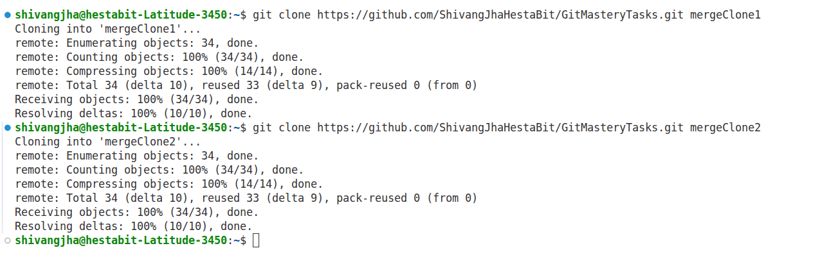
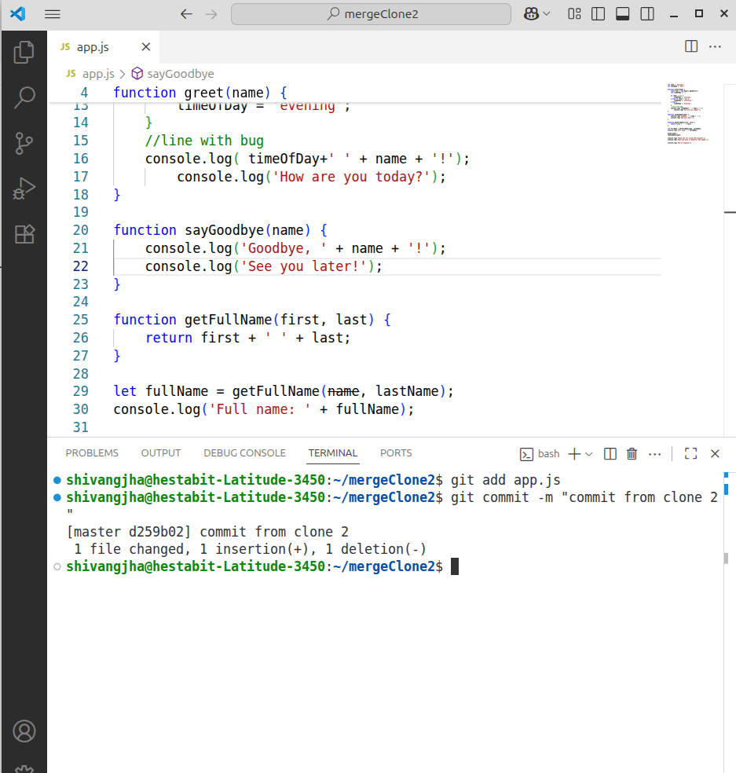

Step 1:
    Clone the repo using the command: git clone <repoLink> cloned_repo_name
    

Step 2:
    create changes in any one clone 
    
    and commit them and push them 

Step 3: 
    create conflicting edits in other clone commit them 
    when we try to push it will show a message as shown in the image
    

    then use command git pull to pull the changes made by other clone 
    use command: git pull origin master 
    you will see conflicts like 
        
    resolve the conflicts and all chnages will be pushed and the graph will look like.
    
