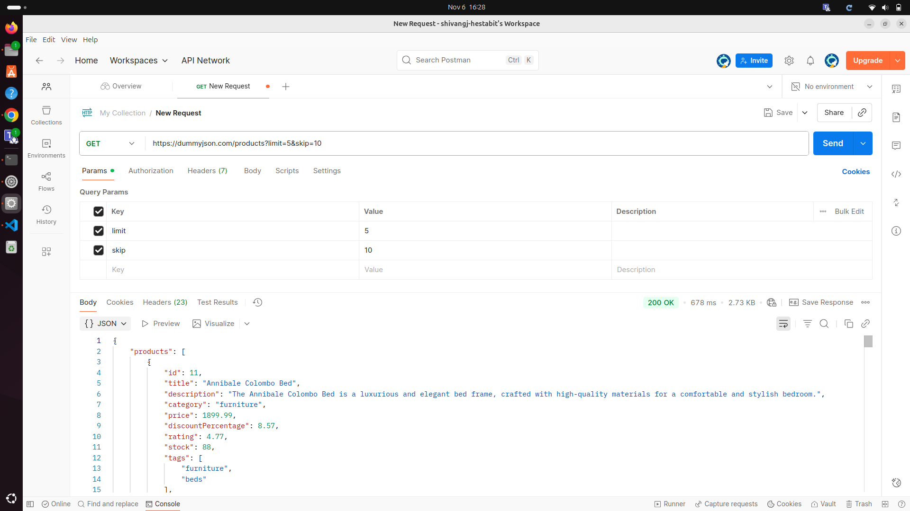
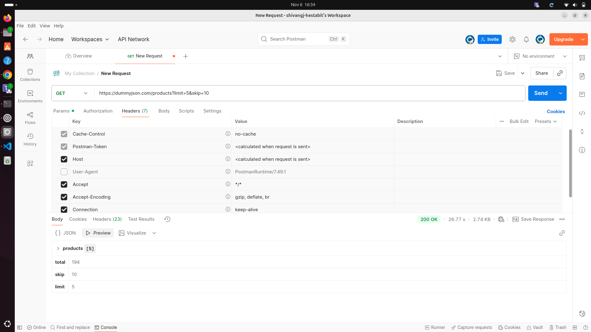
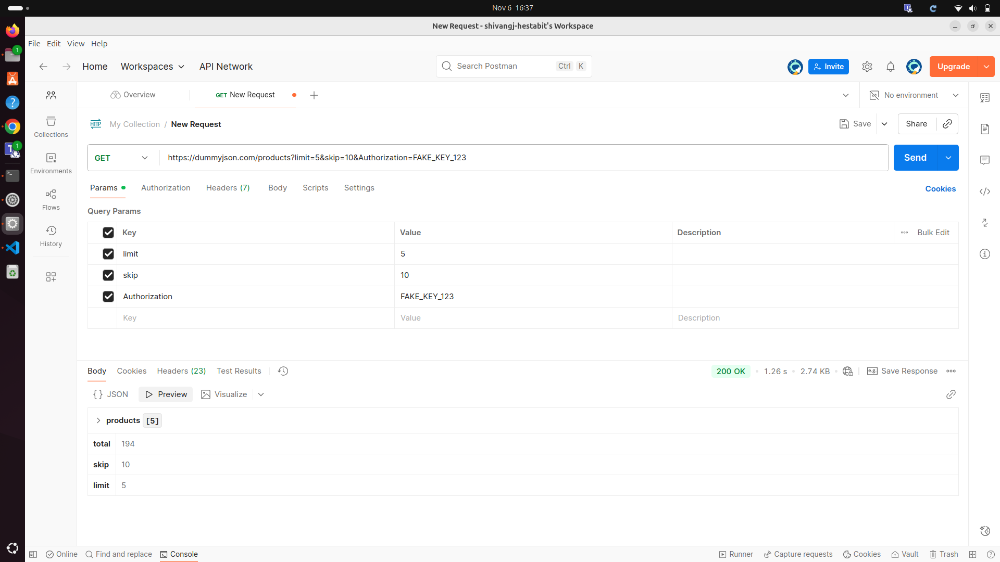
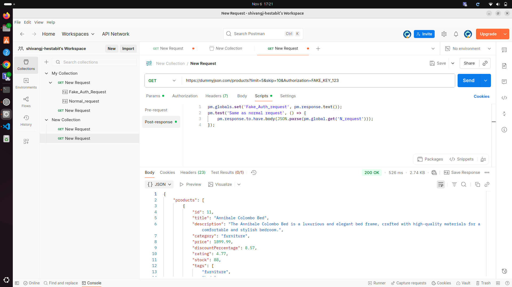
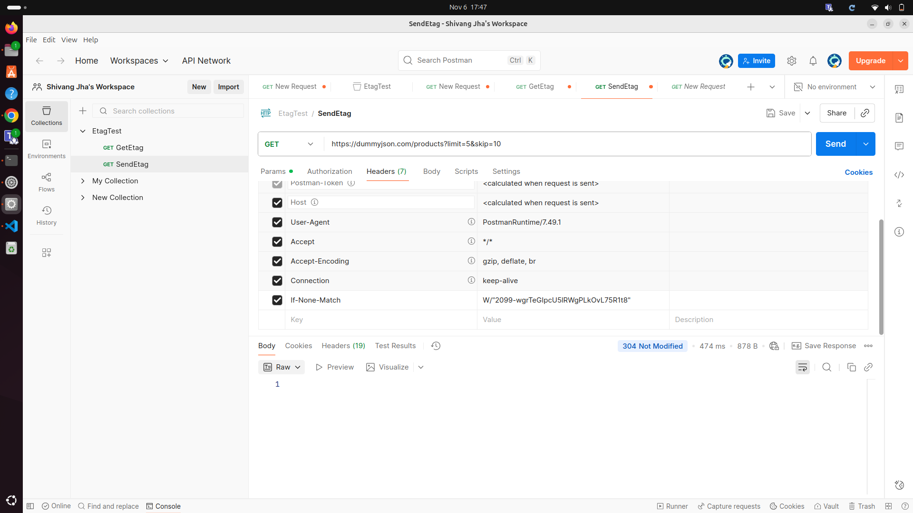
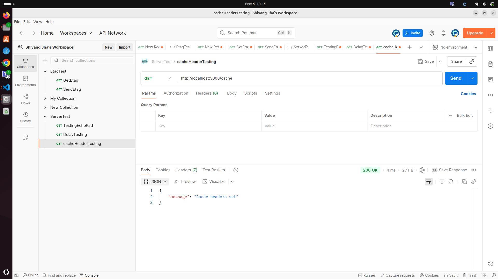

1) Perform DNS Lookup and Traceroute
   DNS lookup translates a human-readable domain name into a machine-readable IP address, while traceroute maps the route a data packet takes to a destination and identifies any points of delay or failure along the way. 
   a) We can do DNS lookup using the command 
      nslookup <domain_name>
         Output:
            

   b) We can do Traceroute using the command:
      traceroute <domain_name>
         Output:
            

2) Modify Headers:
   a) Printing both request and respomse( basic request) using postman
      

   b) Removing the User-Agent header
      

   c) Sending fake Authorization header
      
      There was no change in response because dummyjson is a public website and allows everyone to access it.

   d) Save both the responses in postman and compare both the responses

      or we can automate the checking process by adding test script into postman 
         

         what this script does is it compare the response of both the requests and if they are same it return true either it returns false.
         In this case it is returning true as both the response were same.

3) Observe caching
   a) Send the intial request and look for etag in the response headers and copy the etag value
      
   
   b) Resend the request after adding the If-None-Match header and setting its value equal to the etag
      
      
5) Build a small Node HTTP server with endpoints:
   Screenshots of testing using postman
   
   
   